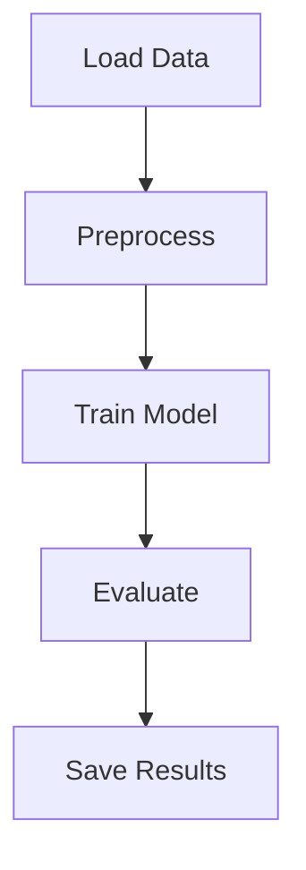

# breast-cancer-ml-pipeline
Автоматизированный ETL-проект для диагностики рака легких


*Для запуска:*

```bash
python3 -m venv venv
source venv/bin/activate
pip install -r requirements.txt
airflow standalone
# в Airflow UI включить и выполнить DAG 'pipeline_dag'
```

## Этап 1. Планирование пайплайна

#### Формулировка ML-задачи
- Задача: бинарная классификация опухолей на доброкачественные (0) и злокачественные (1) на основе диагностических признаков из датасета Breast Cancer Wisconsin Diagnostic.
- Цель: обучить модель LogisticRegression для автоматического выявления злокачественных случаев с высокой точностью, полнотой и F1-мерой.

#### Схематичное представление пайплайна


#### Краткое описание шагов
- Load Data: Загружаем CSV-файл (data.csv) с диагностическими данными в pandas DataFrame.
- Preprocess: Удаляем ненужные колонки (id). Переименовываем столбцы в snake_case. Удаляем или заполняем пропуски. Нормализуем признаки (StandardScaler). Разделяем данные на признаки (X) и цель (y).
- Train Model: Разбиваем X и y на обучающую и тестовую выборки (80/20). Обучаем модель LogisticRegression на тренировочных данных.
- Evaluate: Предсказываем на тестовом наборе. Считаем метрики качества: Accuracy, Precision, Recall, F1.
- Save Results: Сохраняем модель (model.pkl) и метрики (metrics.json) в каталог results/.

##  Этап 2. Разработка ETL-компонентов
#### Назначение скриптов и их связи в пайплайне
- etl/load_data.py Загружает исходный CSV-файл с медицинскими данными, выполняет первичный анализ (например, проверку пропусков и базовые статистики). Результат — необработанные данные для дальнейшей обработки.
- etl/preprocess.py Выполняет очистку и предобработку данных: удаляет ненужные колонки, переименовывает столбцы, обрабатывает пропуски, нормализует признаки. На выходе — готовый к обучению набор данных.
- etl/train_model.py Обучает модель LogisticRegression на подготовленных данных. Делит выборку на тренировочную и тестовую, обучает модель и сохраняет обученный объект.
- etl/evaluate.py Вычисляет метрики качества модели (Accuracy, Precision, Recall, F1) на тестовой выборке, чтобы оценить ее эффективность.
- etl/save_results.py Сохраняет результаты работы пайплайна: сериализованную модель (model.pkl) и метрики (metrics.json) в папку results/.

#### Взаимодействие между скриптами
- load_data.py подготавливает исходные данные и передает их в preprocess.py.
- preprocess.py очищает данные и подготавливает их для обучения, передавая дальше в train_model.py.
- train_model.py обучает модель и сохраняет ее. Затем запускается evaluate.py для подсчета метрик.
- В конце save_results.py сохраняет все выходные артефакты в папку results/.

##  Этап 3. Оркестрация пайплайна с помощью Airflow
#### DAG: pipeline_dag

#### Описание DAG и зависимостей между задачами
DAG pipeline_dag реализует полный ML-пайплайн по обработке данных и обучению модели диагностики рака молочной железы. В нем последовательно выполняются следующие задачи:
- load_data — загрузка и первичный анализ исходных данных.
- preprocess — очистка и предобработка данных (удаление пропусков, нормализация и др.).
- train_model — обучение модели LogisticRegression на подготовленных данных.
- evaluate_model — расчет метрик качества модели (Accuracy, Precision, Recall, F1).
- save_results — сохранение обученной модели и метрик в папку results/.

Зависимости между задачами установлены последовательно, то есть каждая задача начинается только после успешного завершения предыдущей:
load_data >> preprocess >> train_model >> evaluate_model >> save_results

#### Инструкция по запуску DAG и отдельных задач
- Запуск всего DAG вручную (например, с помощью CLI): airflow dags trigger pipeline_dag
- Тестовый запуск конкретной задачи (например, train_model) на определенную дату: airflow tasks test pipeline_dag train_model 2025-06-29
- Просмотр статуса DAG и задач через веб-интерфейс по адресу: http://localhost:8080


##  Этап 4. Интеграция с облачным хранилищем или локальным диском
#### Интеграция с хранилищем
В данном проекте результаты пайплайна сохраняются на локальный диск в папку `results/`.

#### Как это работает
После вычисления метрик и обучения модели, артефакты сохраняются в виде файлов:
- модель — в формате `pickle` (`.pkl`)
- метрики — в формате JSON (`.json`)
- Папка `results/` создаётся в корне проекта (если её нет, создаётся автоматически).
- Airflow DAG последовательно запускает задачи, которые в конце сохраняют файлы в эту папку.

#### Формат данных
- Модель сохраняется с помощью Python `pickle`:
```python
import pickle

with open('results/model.pkl', 'wb') as f:
    pickle.dump(model, f)
```
- Метрики сохраняются в JSON
```
{
  "accuracy": 0.95,
  "precision": 0.94,
  "recall": 0.96,
  "f1_score": 0.95
}

```

##  Этап 5. Анализ ошибок и устойчивости
Потенциальные точки сбоя:
- Недоступность источника данных (файл) — возможна ошибка чтения.
- Некорректный или неполный формат данных (null-значения, пропуски).
- Сбой при сохранении результатов (отсутствие прав, диск переполнен).

Обработка исключений и устойчивость:
- В Airflow настроены retries и retry_delay для повторных попыток задач при сбоях.
- Таймауты (execution_timeout) ограничивают время выполнения задачи.
- Используются failure callbacks для уведомлений и отдельной обработки ошибок.
- Каждый этап реализован в отдельном модуле/скрипте с проверками входных данных.
- Валидация и очистка данных перед обучением предотвращают ошибки из-за некорректных значений.
- Ошибки одной задачи не останавливают весь DAG — сбои изолированы.

Что происходит при сбоях:
- При потере соединения с источником — задача повторяется автоматически.
- При получении невалидных данных — возникает ошибка, логируется и задача может быть повторена или пропущена.
- При невозможности обучения — ошибка фиксируется, результат не сохраняется, последующие задачи могут быть остановлены или выполнены по условиям.

